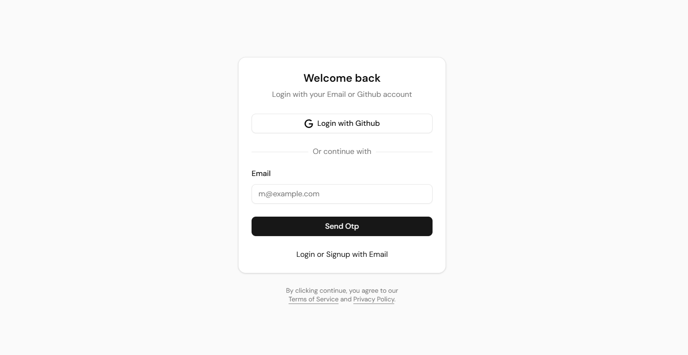
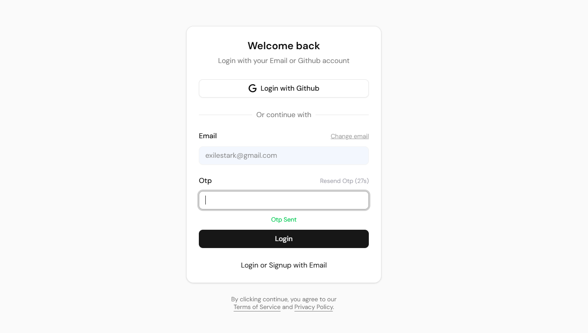

# Implementation of Better-auth in NextJS Project

This repository is a demonstration of how to implement better-auth on a NextJS project. It's a higly production oriented authentication system that provides a robust and secure way to manage user authentication and authorization.

# Uses

- Nextjs (App Router)
- Better-auth
- Primsa
- Postgres
- Nodemailer

## Features

- Signout, Signin with Oauth ✅
- Signin/signup with Email Otp ✅
- Redirect to Signin page if not authenticated ✅
- Redirect to requested page after signin ✅
- Signin with email and password (todo).
- Resend email Otp with cooldown timer ✅
- Accessing Session on both client and server. ✅
- Protecting routes on both client and server with nextjs middleware. ✅

## ScreenShot(s)

